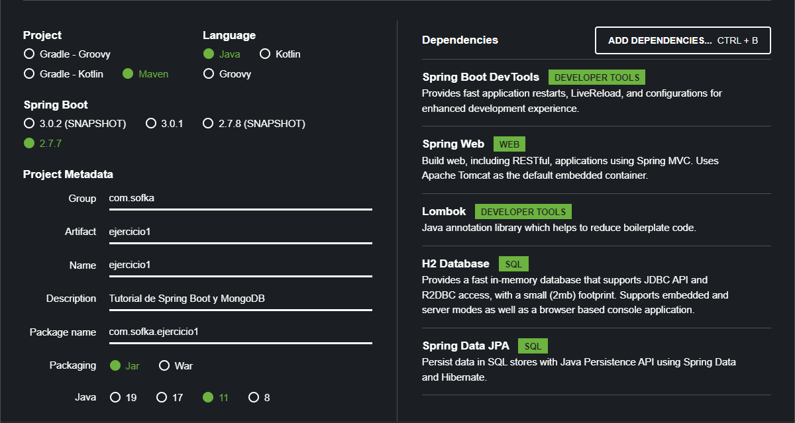

# API en Spring Boot con Base De Datos H2 

Proyecto realizado en Spring Boot con las siguientes dependencias:

* Spring Boot Dev Tools
* Spring Web
* Lombok
* H2 Database
* Srping Data JPA

Para correr el código, abrir una terminal y utilizar el comando: mvn spring-boot:run

Podemos acceder al API desde un navegador a través de la URL: http://localhost:8080/usuarios

Desde un navegador podemos acceder a la Base de Datos a través de la URL:  http://localhost:8080/h2-console 

Con los siguientes datos: 
* Username = h2 
* Password = h2

